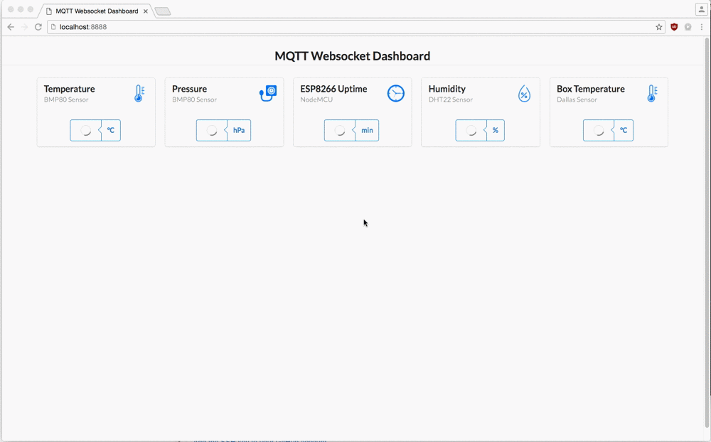

# MQTT Websocket Dashboard 

I searched for a opportunity to receive `mqtt` message from my `ESP8266` Module and display it live in a Browser. I found a tutorial from [Robert Hekkers](http://blog.hekkers.net/2012/10/13/realtime-data-with-mqtt-node-js-mqtt-js-and-socket-io/). But the example didn't work for me.
After some hours spent on studying `node.js`, `Javascript` and `Socket.io` - i ended up with this nice looking Dashboard.

Basically it's the same concept of code with some enhancements.

## How to Install:

1. Install `node.js` (in my case, i used the newest Package-Installer for Mac from [nodejs.org](https://nodejs.org/dist/v6.1.0/))
	
		brew install nodejs

2. Clone the Repo

		git clone

3. Download the Dependencies

		npm install mqtt
		npm install socket.io
		
4. Start the Server

		node app.js
		
5. Open your Browser

		http://localhost:8888

## How

I used [ESPeasy](http://esp8266.nu) on my ESP-Module that publish's the Data to my Raspberry and Mosquitto.

## To Do...

 - ...better Documentation
 - find out how to build the div's dynamicly based on the topic names/data (static divs)
 - how to build a config menu to subscribe topics in a webinterface and save that to a database
 - better comprehension in Javascript etc.
 - and of course better englisch :D

 If somebody have the knowledge or have improvements - feel free to tell me how ;)
	

## Credits

- Robert Hekkers - Realtime data with MQTT, Node.js, MQTTClient.js and Socket.IO - http://blog.hekkers.net/2012/10/13/realtime-data-with-mqtt-node-js-mqtt-js-and-socket-io/
- node.js - http://nodejs.org
- socket.io - http://socket.io/
- jquery - https://jquery.com
- Sematic UI - https://github.com/Semantic-Org/Semantic-UI
- Responsive Grid System  - http://responsivegridsystem.com
- Gifrocket - http://www.gifrocket.com
- 
Icons made from <a href="http://www.flaticon.com" title="Flaticon">www.flaticon.com</a> is licensed by <a href="http://creativecommons.org/licenses/by/3.0/" title="Creative Commons BY 3.0" target="_blank">CC 3.0 BY</a>
